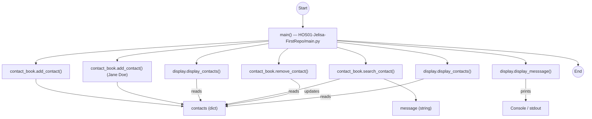

# Execution Flow, Module Structure, and Data Flow

## Execution Flow
1. Program entry: run the script `HOS01-Jelisa-FirstRepo/main.py` (executed when `__name__ == "__main__"`).
2. `main()` initializes an empty `contacts` dictionary.
3. `main()` calls `contact_book.add_contact(contacts, "John Doe", "123-456-7890")` and `add_contact(..., "Jane Doe", ...)` to add entries; these functions update and return the `contacts` dict.
4. `main()` calls `display.display_contacts(contacts)` to print the current contact list.
5. `main()` calls `contact_book.search_contact(contacts, "John Doe")` which returns either the matching phone string or a not-found message; result is stored in `message`.
6. `main()` calls `display.display_messsage(message)` to print the search result.
7. `main()` calls `contact_book.remove_contact(contacts, "John Doe")` to remove the contact; the updated `contacts` dict is returned.
8. `main()` calls `display.display_contacts(contacts)` again to show the final state.
9. `main()` exits and the program ends.

## Module Structure
- `HOS01-Jelisa-FirstRepo/main.py`
  - `main()` — orchestrates contact operations and uses `contact_book` and `display` functions.
- `HOS01-Jelisa-FirstRepo/contact_book.py`
  - `add_contact(contacts, name, phone)` — adds/updates `contacts[name] = phone` and returns the dict.
  - `remove_contact(contacts, name)` — removes `name` from `contacts` (prints removal status) and returns the dict.
  - `search_contact(contacts, name)` — returns `contacts.get(name, "<name> not found.")`.
  - `list_contacts(contacts)` — intended to return a list of contacts but currently contains a bug (see notes).
- `HOS01-Jelisa-FirstRepo/display.py`
  - `display_messsage(message)` — prints `message` (function name has a typo: extra 's').
  - `display_contacts(contacts)` — iterates `contacts.items()` and prints name/phone pairs.

## Data Flow Diagram (Mermaid)

## Observations / Notes
- `contact_book.list_contacts` currently returns `contactss` (typo) which will raise a NameError if invoked.
- `display.display_messsage` is spelled with three 's' characters; `main.py` imports and uses that same spelling, so they match, but the name is non-standard and could be corrected to `display_message` for clarity.
- `main.py` imports `message` from `email.mime` (unused) — likely unnecessary.

If you want, I can: fix the small bugs (`list_contacts` return, unify `display_message` spelling), run tests, or add a README snippet describing usage.
